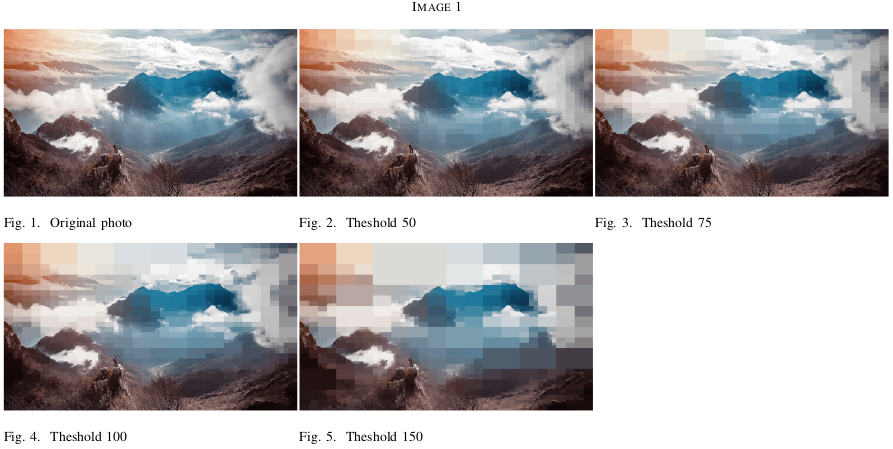
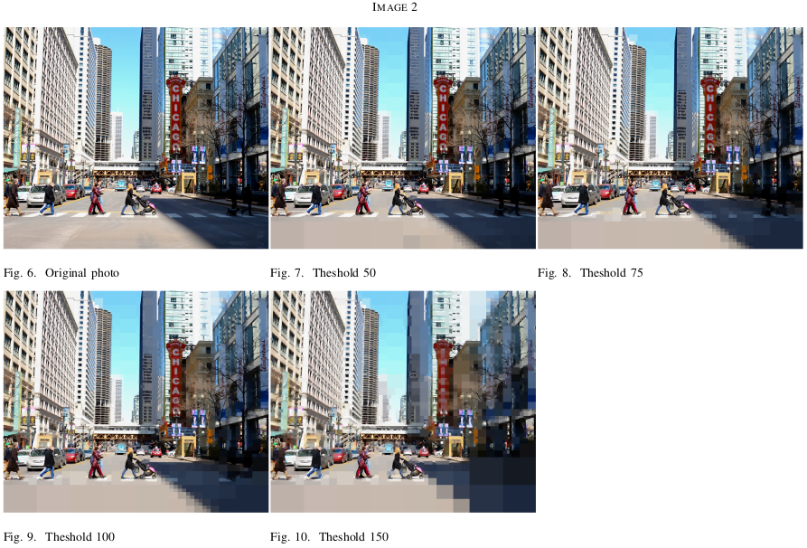
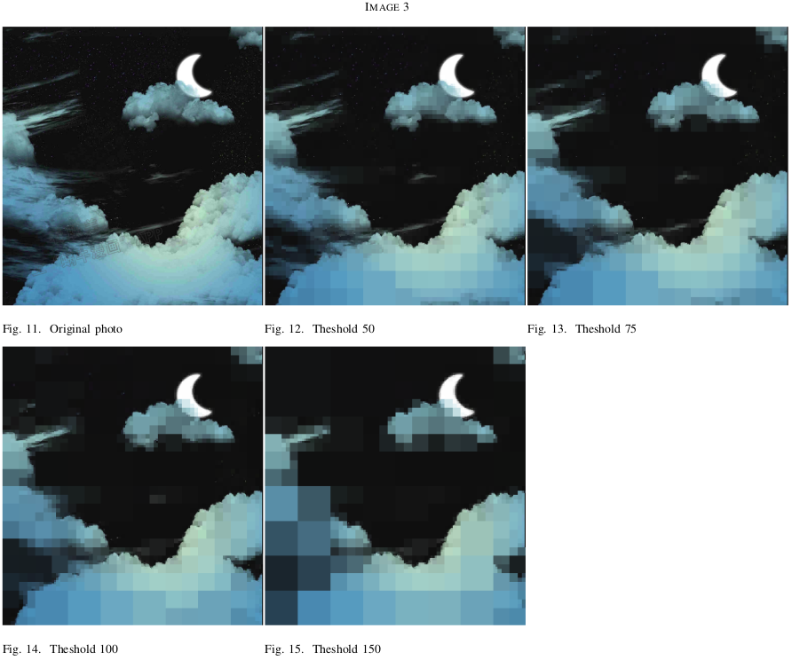
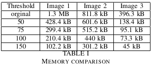

# Quad tree

Quad tree implementation

## Setup

Run `make` to compile the executables and run tests.

## Tests

### Quad tree

Test the plain quad tree implementation with

```
./bin/quad_tree < data/quad_tree/test.in
```

### Image quad tree

There are two image formats for image-based quad tree tests: binary images and RGB images.

#### Binary image

Binary images have pixels with one channel which can take as value only 0 or 1. For this reason, the reconstructed image from a quad tree compression should be exactly the same as the original image. We can observe the results by running

```
./bin/binary_image < data/binary/image_quad_tree_horse.in
```

#### RGB image

With traditional RGB images, information is lost during compression. We can compress an image by executing the following commands:

```
python3 process_image_input.py <image_path> data/rgb/test.in
./bin/compress data/compressed/test.dat <threshold> < data/rgb/test.in
```
Trees saved on the default location shown above can be decompressed easily by executing `./decompress.sh`. For an example compression run `./compress.sh`, which compresses a sample image with a threshold of 100. Both the original and reconstructed images are shown below.

#### Results



#### Memory comparison

